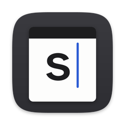
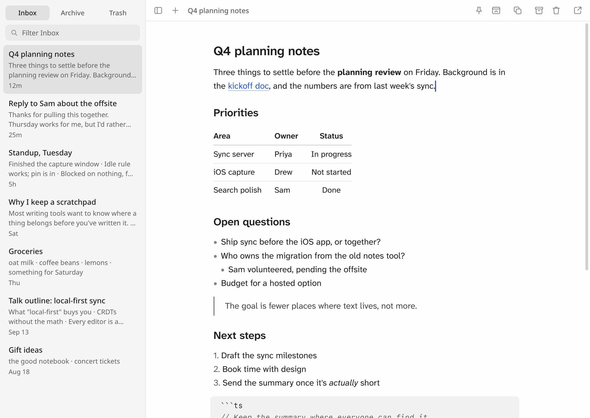
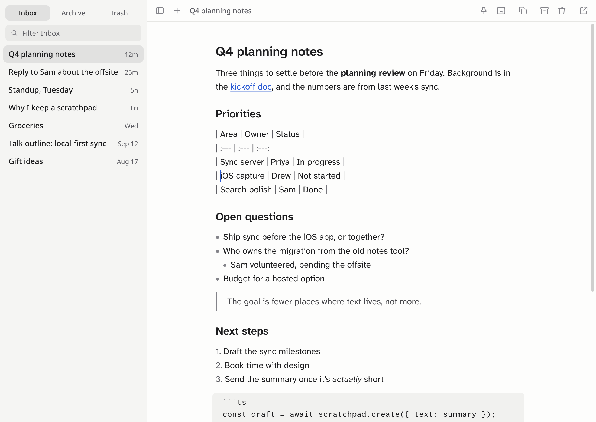
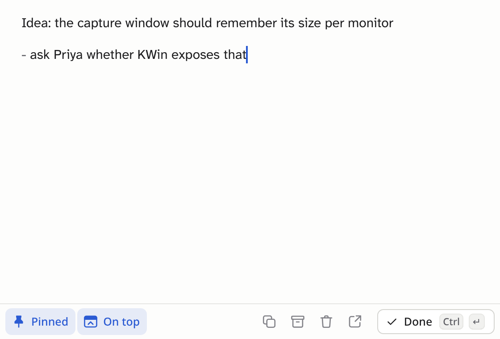
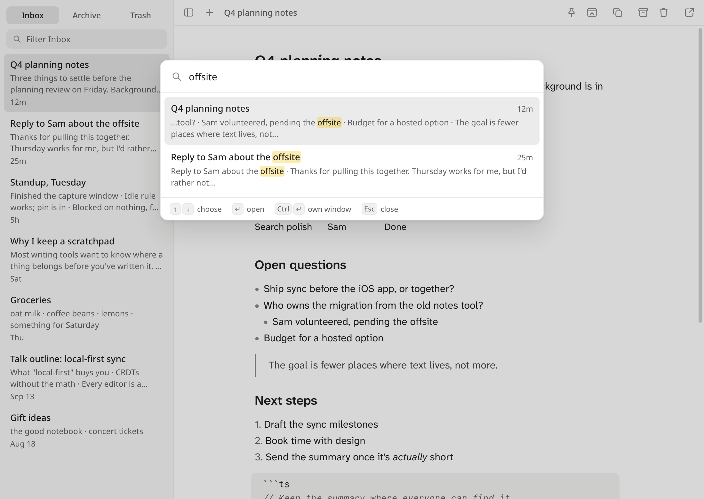

<p align="center"></p>

# scratchpad

A place where text starts. Write the first version of something, like a reply, meeting notes or a paragraph for a doc, shape it, then copy it wherever it's going. scratchpad keeps every draft in one list and asks you to make one decision about each: whether you're done with it.

<picture>
  <source media="(prefers-color-scheme: dark)" srcset="docs/images/main-dark.png">
  
</picture>

It's inspired by [Drafts](https://getdrafts.com), and it runs on macOS and Linux.

## What it does

**No filing.** There are no folders, file names or tags. Every draft lives in the Inbox, newest first, with its first line as its title and a glimpse of what follows. When you're done with a draft, archive it. The Trash empties itself after 30 days.

**Markdown, shown as it will look.** Type markdown and it renders in place: headings, bold and italics, links, lists, task lists, quotes, code and tables. The syntax comes back only where your cursor is, so you can still edit it, and the text underneath is always plain markdown, ready to paste anywhere.



**Capture from anywhere.** A global hotkey brings up a small floating window for getting a thought down. Esc hides it again, and ⌘↩ files the draft and clears the window for next time. If you come back after 15 minutes away, it starts on a fresh draft, unless you've pinned it to keep one going through a long meeting.

<picture>
  <source media="(prefers-color-scheme: dark)" srcset="docs/images/capture-dark.png">
  
</picture>

**Copy as rich text.** One shortcut puts the draft on the clipboard as formatted text, with the markdown alongside, so pasting into Slack, email or a document keeps the formatting.

**Find anything.** ⌘K opens a quick switcher that searches the title and text of every draft. The sidebar filter narrows the list you're looking at, and ⌘F finds within a draft.



**Windows your way.** Open any draft in its own window, and float any window above the others.

**Links to drafts.** Every draft has a link, like `scratchpad://open/01M3G7C7CR24T3SX6X10R5R6S8`, that opens it in the app. Copy it from the Draft menu or the sidebar's context menu and paste it anywhere you keep notes, tasks or chat.

**Made for agents too.** A command-line tool and an MCP server let scripts and AI agents search, read, create and edit drafts. Everything that edits a draft, whether that's you, an agent or another window, makes versioned edits that merge. An agent can revise a draft while you're typing in it without losing your words, and undo only undoes your own typing.

**Local and fast.** Your drafts stay in a database on your computer. Typing never waits on anything: each window edits its own copy of the draft and syncs with a small background service.

## Install

### macOS

For Macs with Apple silicon.

1. Download the `.dmg` from the [latest release](https://github.com/dru89/scratchpad/releases/latest), open it, and drag scratchpad to Applications.
2. Open scratchpad. It adds itself to your login items so the capture hotkey is always ready. You can turn that off with **scratchpad > Open at Login**. It updates itself when a new version is out.
3. Press ⌘⇧2 in any app to capture a thought.

To use scratchpad from the terminal, choose **scratchpad > Install Command Line Tool**, which links `scratchpad` into `~/.local/bin`.

### Linux

For now, build it from source. You need Rust 1.89 or newer and Node.js 24. It's developed on KDE Plasma on Wayland; other desktops work, but you'll set up the capture hotkey yourself.

```bash
git clone https://github.com/dru89/scratchpad && cd scratchpad
cargo install --locked --root ~/.local --path crates/daemon
cargo install --locked --root ~/.local --path crates/cli
cd app && npm install && npm run build
scripts/install-linux.sh
```

The install script adds scratchpad to your application launcher and starts it in the background when you log in (pass `--no-autostart` to skip that). On KDE it also sets Meta+Shift+2 to open the capture window; confirm that once in System Settings > Keyboard > Shortcuts. On other desktops, bind a shortcut to `scratchpad capture`. `scripts/install-linux.sh --uninstall` removes it all.

To update, run `scripts/update-linux.sh` from `app/`. It pulls, reinstalls the daemon and CLI, rebuilds the app and restarts it in the background.

## Keyboard shortcuts

| action | macOS | Linux |
| --- | --- | --- |
| Capture from anywhere | ⌘⇧2 | Meta+Shift+2 |
| New draft | ⌘N | Ctrl+N |
| Done: file it and start fresh | ⌘↩ | Ctrl+Enter |
| Quick switcher | ⌘K | Ctrl+K |
| Pin, so the window keeps its draft | ⇧⌘P | Ctrl+Shift+P |
| Float on top | ⇧⌘F | Ctrl+Shift+F |
| Copy as rich text | ⇧⌘C | Ctrl+Shift+C |
| Archive, or move back to the Inbox | ⇧⌘A | Ctrl+Shift+A |
| Trash, or restore | ⇧⌘⌫ | Ctrl+Shift+Backspace |
| Open in its own window | ⇧⌘O | Ctrl+Shift+O |
| Get info | ⌘I | Ctrl+I |
| Show or hide the sidebar | ⌘\ | Ctrl+\ |
| Inbox, Archive, Trash | ⌘1, ⌘2, ⌘3 | Ctrl+1, Ctrl+2, Ctrl+3 |
| Filter the sidebar | ⇧⌘L | Ctrl+Shift+L |
| Find, and find and replace | ⌘F, ⌥⌘F | Ctrl+F, Ctrl+H |
| Nest a list item, or move it back out | Tab, ⇧Tab | Tab, Shift+Tab |
| Hide the capture window | Esc | Esc |

Closing the main window keeps scratchpad running for the hotkey. Quit from the menu, or with ⌘Q (Ctrl+Q on Linux).

## Command line and agents

```bash
scratchpad new "# Idea" "for later"      # prints the new draft's id
echo "more thoughts" | scratchpad append 01M3F9ZX7F
scratchpad list                          # the Inbox, newest first; --archived, --trash, --all
scratchpad search sync "rich copy"       # every word must match; quote phrases
scratchpad show 01M3F9ZX7F               # the draft as markdown
scratchpad edit 01M3F9ZX7F               # in $EDITOR; typing done elsewhere meanwhile is kept
scratchpad archive 01M3F9ZX7F            # also trash and restore
scratchpad link 01M3F9ZX7F               # the scratchpad:// link that opens it in the app
scratchpad export ~/scratchpad-backup    # every draft as markdown; --zip for a single file
scratchpad capture                       # open the capture window, from Raycast, a script or anything else
```

Any unique prefix of a draft's id works, and `--json` gives machine-readable output, including each draft's link.

For AI agents, `scratchpad mcp` is an MCP server. To add it to Claude Code for every project:

```bash
claude mcp add --scope user scratchpad -- ~/.local/bin/scratchpad mcp
```

Agents can list, search, read, create, update and append to drafts, and archive, trash or restore them. None of the tools delete anything permanently. Results include each draft's link, so an agent can hand you one to click.

## Your data

Drafts live in `~/Library/Application Support/dev.unremarkable.scratchpad/` on macOS and `~/.local/share/scratchpad/` on Linux. There's no sync yet, and your drafts never leave your computer; the Mac app only checks GitHub for new versions. To take everything with you, **File > Export All…** saves every draft as markdown in a zip, in Inbox, Archive and Trash folders, with a `drafts.json` that records ids and dates. **Export…** in the Draft menu saves a single draft as a `.md` file, and `scratchpad export` does the same as Export All from the terminal.

## Status

scratchpad is young, and built by one person for daily use. Sync between your devices, end-to-end encrypted through a server you can host yourself, comes next, followed by an iPhone app. The [roadmap](docs/roadmap.md) has more. The name is a working one.

## Building and contributing

[`docs/development.md`](docs/development.md) covers building from source, the tests, packaging, and how the pieces fit together. [`docs/design.md`](docs/design.md) explains how it works, and [`docs/visual-design.md`](docs/visual-design.md) how it looks and why.
